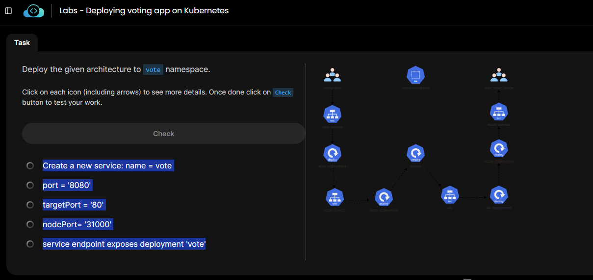

## Deploy the given architecture to vote namespace.


Click on each icon (including arrows) to see more details. Once done click on Check button to test your work.




## 1- Voting servides 
```bash
Create a new service: name = vote
port = '8080'
targetPort = '80'
nodePort= '31000'
service endpoint exposes deployment 'vote'
```
```bash

#File তৈরি করুন

vi /root/vote-service.yaml

 #পুরো YAML paste করুন
```bash
apiVersion: v1
kind: Service
metadata:
  name: vote
  namespace: vote
spec:
  type: NodePort
  selector:
    app: vote
  ports:
  - port: 8080
    targetPort: 80
    nodePort: 31000


#প্রথমে namespace তৈরি করুন:
kubectl create namespace vote

 #তারপর Service তৈরি করুন:
kubectl create -f /root/vote-service.yaml

# Check:
kubectl get svc -n vote
```

## 2- Vote Deploment
```bash
Create a deployment: name = 'vote'
image = 'dockersamples/examplevotingapp_vote'
status: 'Running'
```

vote namespace-এ vote Deployment তৈরি করতে:

1. YAML file তৈরি করুন
vi /root/vote-deployment.yaml

এটা লিখুন:
```bash
apiVersion: apps/v1
kind: Deployment
metadata:
  name: vote
  namespace: vote
spec:
  replicas: 1
  selector:
    matchLabels:
      app: vote
  template:
    metadata:
      labels:
        app: vote
    spec:
      containers:
      - name: vote
        image: dockersamples/examplevotingapp_vote
```
Save:
Esc → :wq → Enter

2. Deployment তৈরি করুন
```bash
kubectl create -f /root/vote-deployment.yaml
```
3. Status check করুন
```bash
kubectl get deployment -n vote
kubectl get pods -n vote
```
Pod 1/1 Running হলে কাজ ঠিক আছে।

### 3- Redis Service
```bash
New Service, name = 'redis'
port: '6379'
targetPort: '6379'
type: 'ClusterIP'
service endpoint exposes deployment 'redis'
```
vote namespace-এ redis Deployment-এর জন্য Service তৈরি করুন।


```bash
vi /root/redis-service.yaml
```
1. YAML file
```bash
apiVersion: v1
kind: Service
metadata:
  name: redis
  namespace: vote
spec:
  type: ClusterIP
  selector:
    app: redis
  ports:
  - port: 6379
    targetPort: 6379
```
Save: Esc → :wq → Enter

2. Create করুন
``bash
kubectl create -f /root/redis-service.yaml
```
3. Check করুন
```bash
kubectl get svc -n vote
kubectl get endpoints redis -n vote
```

### 4- Redis Deploment
```bash
Create new deployment, name: 'redis'
image: 'redis:alpine'
Volume Type: 'EmptyDir'
Volume Name: 'redis-data'
mountPath: '/data'
status: 'Running'
```

vote namespace-এ redis Deployment তৈরি করতে এই YAML ব্যবহার করুন:
```bash
vi /root/redis-deployment.yaml
```
```bash
apiVersion: apps/v1
kind: Deployment
metadata:
  name: redis
  namespace: vote
spec:
  replicas: 1
  selector:
    matchLabels:
      app: redis
  template:
    metadata:
      labels:
        app: redis
    spec:
      containers:
      - name: redis
        image: redis:alpine
        volumeMounts:
        - name: redis-data
          mountPath: /data
      volumes:
      - name: redis-data
        emptyDir: {}
```
Save করুন:

Esc → :wq → Enter

তারপর:
```bash
kubectl create -f /root/redis-deployment.yaml
```
Check:
```bash
kubectl get deployment -n vote
kubectl get pods -n vote
```
Redis Pod-এর READY যদি 1/1 এবং STATUS Running হয়, তাহলে ঠিক আছে।


### 5- worker Deployment 
```bash
Create new deployment. name: 'worker'
image: 'dockersamples/examplevotingapp_worker'
status: 'Running'
```
vote namespace-এ worker Deployment তৈরি করুন।

1. YAML file
```bash
vi /root/worker-deployment.yaml
```
```bash
apiVersion: apps/v1
kind: Deployment
metadata:
  name: worker
  namespace: vote
spec:
  replicas: 1
  selector:
    matchLabels:
      app: worker
  template:
    metadata:
      labels:
        app: worker
    spec:
      containers:
      - name: worker
        image: dockersamples/examplevotingapp_worker
```
Save:

Esc → :wq → Enter

2. Create করুন
```bash
kubectl create -f /root/worker-deployment.yaml
```
3. Check করুন
```bash
kubectl get deployments -n vote
kubectl get pods -n vote
```

worker Pod-এর READY 1/1 এবং STATUS Running হলে ঠিক আছে।


### 6- DB
```bash
Create new service: 'db'

port: '5432'

targetPort: '5432'

type: 'ClusterIP'

service endpoint exposes deployment 'db'
```

1. YAML file তৈরি করুন
```bash
vi /root/db-service.yaml
```
```bash
apiVersion: v1
kind: Service
metadata:
  name: db
  namespace: vote
spec:
  type: ClusterIP
  selector:
    app: db
  ports:
  - port: 5432
    targetPort: 5432
```
Save করুন:

Esc → :wq → Enter

2. Service তৈরি করুন
```bash
kubectl create -f /root/db-service.yaml
```
3. Check করুন
```bash
kubectl get svc -n vote
kubectl get endpoints db -n vote
```
⚠️ endpoints db যদি <none> দেখায়, তাহলে db Deployment-এর label check করুন:


#### 7- db Deployment
```bash
Create new deployment. name: 'db'
image: 'postgres:15-alpine' and add the env: 'POSTGRES_HOST_AUTH_METHOD=trust'
Volume Type: 'EmptyDir'
Volume Name: 'db-data'
mountPath: '/var/lib/postgresql/data'
status: 'Running'
```

1. YAML file
```bash
vi /root/db-deployment.yaml
```
```bash
apiVersion: apps/v1
kind: Deployment
metadata:
  name: db
  namespace: vote
spec:
  replicas: 1
  selector:
    matchLabels:
      app: db
  template:
    metadata:
      labels:
        app: db
    spec:
      containers:
      - name: db
        image: postgres:15-alpine
        env:
        - name: POSTGRES_HOST_AUTH_METHOD
          value: "trust"
        volumeMounts:
        - name: db-data
          mountPath: /var/lib/postgresql/data
      volumes:
      - name: db-data
        emptyDir: {}
```
Save:

Esc → :wq → Enter

2. Create করুন
```bash
kubectl create -f /root/db-deployment.yaml
```
3. Check করুন
```bash
kubectl get deployment -n vote
kubectl get pods -n vote
```
db Pod-এর:

READY   1/1
STATUS  Running

হওয়া উচিত।

DB Service-এর endpoint-ও check করতে পারেন:

kubectl get endpoints db -n vote


### 8- result Deployment
```bash
Create new deployment, name: 'result'

image: 'dockersamples/examplevotingapp_result'

status: 'Running'
```
vote namespace-এ result Deployment তৈরি করুন।
```bash
vi /root/result-deployment.yaml
```
এই YAML দিন:
```bash
apiVersion: apps/v1
kind: Deployment
metadata:
  name: result
  namespace: vote
spec:
  replicas: 1
  selector:
    matchLabels:
      app: result
  template:
    metadata:
      labels:
        app: result
    spec:
      containers:
      - name: result
        image: dockersamples/examplevotingapp_result
```
Save: Esc → :wq → Enter

তারপর:
```bash
kubectl create -f /root/result-deployment.yaml
```
Check:
```bash
kubectl get deployment -n vote
kubectl get pods -n vote
```
result Pod-এর READY 1/1 এবং STATUS Running হলে ঠিক আছে।

### 9- result service
```bash 
Create a new service: name = result

port: '8081'

targetPort: '80'

NodePort: '31001'

service endpoint exposes deployment 'result'
```
vote namespace-এ result Deployment-এর জন্য NodePort Service তৈরি করুন।

1. YAML তৈরি করুন
```bash
vi /root/result-service.yaml
```
```bash
apiVersion: v1
kind: Service
metadata:
  name: result
  namespace: vote
spec:
  type: NodePort
  selector:
    app: result
  ports:
  - port: 8081
    targetPort: 80
    nodePort: 31001
```
Save:

Esc → :wq → Enter

2. Service তৈরি করুন
```bash
kubectl create -f /root/result-service.yaml
```
3. Check করুন
```bash
kubectl get svc -n vote
kubectl get endpoints result -n vote
```
result Service-এর জন্য expected:

8081:31001/TCP


